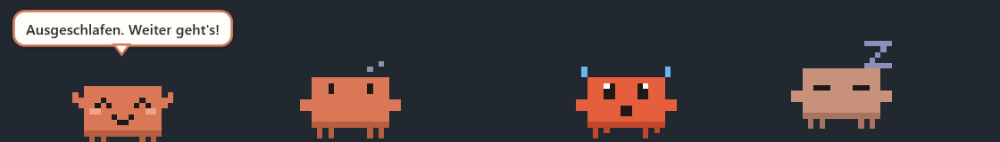
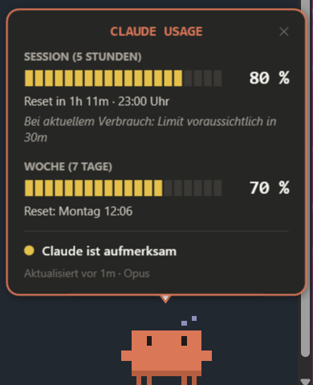

# Claudius - Claude Usage App

**A tiny pixel-art desktop pet for Windows that keeps an eye on your Claude usage limits — and gets visibly nervous when you're about to run out.**

[](https://github.com/T3rr0rS0ck3/claudepet/actions/workflows/release.yml)


🇩🇪 [Deutsche Version](README.de.md)



Claude Pro and Max plans have a rolling **5-hour session limit** and a **weekly limit**.
**Claudius - Claude Usage App** sits on your desktop and shows how much of both you've used — at a glance, without
opening anything. The more you use, the more its mood changes: relaxed → thoughtful → nervous → panicking → asleep
until the limit resets.

> The interface is available in English and German (settings → *Language*). Bubble texts can be changed to any
> language (see [Configuration](#configuration)).

## Features

- 🟠 **Desktop pet** — transparent, borderless, draggable, optionally always on top
- 🚶 **Walks around** — strolls along the taskbar and the tops of open windows, jumps up onto windows,
  climbs the screen edges, swings along the top of the screen until it drops, and falls off when a window
  moves away; after a long fall it lands with a splat and pulls itself back into shape. Its mood sets the pace
  (can be turned off). Optionally it also walks or hops over to the neighbouring monitor, following how your
  monitors are arranged in Windows
- 🎨 **Your color** — pick any color for the pet; the usage overlay, menus and speech bubbles use it as accent color
- 📊 **Usage overlay** — click the pet to see session and weekly usage, reset times and a forecast
- 🎭 **7 moods** with their own animations, based on the higher of the two usage values
- 💬 **Speech bubbles** when thresholds are crossed, e.g. *"90 %! 😰"* — not constantly chattering
- 🔔 **Windows notifications** at configurable session and weekly warning thresholds
- 📈 **Forecast** — "at the current pace you'll hit the limit in 1h 42m"
- 🧺 **Tray icon** that reflects the current mood, plus autostart with Windows
- 👻 **Ghost drag** — drag a ghost of the pet (left mouse button) onto an Explorer window to open Claude Code in that folder
- 📂 **Project launcher** — double-click the pet to pick a project from your repo folder and open Claude Code there
- 🎤 **Voice chat** (optional) — opens Claude Code with its voice dictation switched on; the pet listens while you talk
- ❓ **Session status** — a yellow "?" when a Claude Code session asks something, a bubble when it is done;
  optionally a baby pet per session that trots after the pet
- ⚙️ **Configurable** thresholds, texts, size, update interval, console and more
- 🔒 **Local only** — the pet itself makes no network requests, needs no login and reads no tokens; it only reads what Claude Code already hands to its status line

<p align="center"></p>

## Requirements

- Windows 10 or 11 (x64)
- [Claude Code](https://code.claude.com) (the CLI), signed in with a **Claude Pro or Max** subscription
  (Claude Code only receives rate-limit data for these plans)

No .NET installation needed — the installer is self-contained.

## Installation

The pet is coming to the **Microsoft Store** as *Claudius - Claude Usage App* (signed by Microsoft, updated by the Store).
Until it is listed, or if you prefer GitHub:

1. Download **`ClaudePet-Setup-x.y.z.exe`** from the [latest release](https://github.com/T3rr0rS0ck3/claudepet/releases/latest).
2. Run it. No admin rights required (installs to `%LOCALAPPDATA%\Programs\ClaudePet`).
3. Keep **"Connect to Claude Code"** checked. This adds the pet as Claude Code's `statusLine` (only if you don't have one yet).
4. Send any message in Claude Code — after the first response the pet knows your usage.

Prefer no installer? Grab the `portable.zip` from the release, extract it anywhere and start `ClaudePet.exe`.
Then right-click the pet → *Connect Claude Code…*.

> **Windows SmartScreen** may warn about an unknown publisher because the installer isn't code-signed.
> Click *More info → Run anyway*.

### Updates

The pet looks for a new release on start and once a day. When there is one, it tells you and the right-click
menu shows **Install update to x.y.z…**: one click downloads the setup, checks it against
the release's `SHA256SUMS.txt`, installs it silently and restarts the pet. Portable copies only get a link to the
release page. You can switch the check off or run it by hand in the settings (*Updates*).

## Using the pet

| Action | Result |
|---|---|
| Left-click the pet | Open / close the usage overlay |
| Double-click the pet | Project list: open Claude Code in one of your projects |
| Right-drag the pet | Move it (position is remembered); it kicks its legs while carried and, when walking around, drops down from there |
| Drag the pet onto an Explorer window | Open Claude Code in that folder (see [Opening Claude Code](#opening-claude-code)) |
| Hover the pet | Emote buttons: feed 🍪, pat ❤, play ⚽ and tickle 🪶 it, each with its own reaction (can be turned off) |
| Right-click the pet | Menu: usage, open Claude, voice chat, say hello, always on top, walk around, minimize to tray, connect Claude Code, settings, quit |
| Left-click the tray icon | Open the usage overlay |
| Start `ClaudePet.exe` again | Brings the running pet back and opens the overlay |

## Opening Claude Code

The pet can open Claude Code (`claude`) in a folder of your choice. Where it opens is set in the settings
(*Open Claude in*): *Automatic* (Windows Terminal if installed, otherwise Command Prompt), Windows Terminal,
Command Prompt, PowerShell or *Claude Desktop (Code tab)*. The Desktop option runs `claude --desktop` in the folder,
which needs the Claude Desktop app and a recent Claude Code (`claude update`).

**Ghost drag.** Hold the **left** mouse button on the pet and drag. A translucent ghost of the pet follows the cursor
while the pet itself stays where it is. Over an Explorer window or the desktop the ghost lights up and waves. Release
it there and Claude Code opens in that folder (with Windows 11 tabs: the active tab); the ghost floats away.
Releasing anywhere else, or pressing `Esc`, cancels. Folders without a file system path (e.g. *This PC*) get a short
"no folder here" bubble. Can be switched off in the settings.

**Project list.** Double-click the pet (or right-click → *Open Claude…*, also in the tray menu). The list shows your
recently opened projects first, then all subfolders of your **repo folder** (hidden folders and folders starting with
`.` are skipped). *Choose another folder…* opens any folder, *Set repo folder…* changes the repo folder. On first
use the pet asks for the repo folder right away. A single click now waits for the double-click time before opening
the usage overlay.

**Voice chat.** Off by default; switch on *Offer voice chat* in the settings to get the menu entry
*Start voice chat…*. It uses Claude Code's [voice dictation](https://code.claude.com/docs/en/voice-dictation):
on first use the pet asks to set `voice.enabled` in `~/.claude/settings.json` (a backup is saved), then shows the
project list. In the console, **hold Space** and speak. Requirements: a claude.ai login in Claude Code (not an API key)
and microphone access for the console (Windows Settings → Privacy & security → Microphone). Claude Code has no
command-line flag for voice mode, so dictation is enabled for all Claude Code sessions while the option is on.
Switching *Offer voice chat* off again hides the menu entry and sets `voice.enabled` back to `false`.
While you hold Space in a focused terminal running Claude Code (with dictation on), the pet stops and talks into a
microphone, with sound waves rising above it. Claude Code does not report dictation itself, so the pet goes by the held Space key.

### Moods

The mood follows the **higher** of session and weekly usage. All thresholds are configurable.

| Usage | Mood | What the pet does |
|---:|---|---|
| 0–49 % | 🟢 relaxed | breathes, blinks, waves now and then |
| 50–69 % | 🟢 normal | looks around |
| 70–84 % | 🟡 attentive | thinks hard (thought dots) |
| 85–89 % | 🟠 nervous | sweats, fidgets |
| 90–94 % | 🔴 worried | big eyes, trembling |
| 95–99 % | 🔴 panic | turns red, arms up, flashing "!" |
| 100 % | 😴 limit reached | sleeps until the reset |

While Claude Code is actively sending data, a calm pet "types" along. After a reset it cheers.

## How it works

```text
Claude Code ── status line JSON (stdin) ──▶ ClaudePetBridge.exe ──▶ %LOCALAPPDATA%\ClaudePet\usage.json
                                                   │                                  ▲
                                                   │                                  │ polls
                                                   └── prints the status line   ClaudePet.exe (the pet)
```

Claude Code runs its configured [status line command](https://code.claude.com/docs/en/statusline) after each response
and passes session data — including `rate_limits.five_hour` and `rate_limits.seven_day` — as JSON on stdin.
`ClaudePetBridge.exe` is that command: it stores the values locally and prints a compact status line back into Claude Code:

```text
[Opus] Session 73% (↻ 2h 14m) · Week 61%
```

The pet app runs independently and keeps working when no Claude Code terminal is open; values whose reset time
has passed are treated as 0 %. Nothing is scraped from claude.ai and no credentials are read.

## Questions and finished work

Once Claude Code is connected, the pet also registers a few [hooks](https://code.claude.com/docs/en/hooks) in
`~/.claude/settings.json` (a backup is saved; your own hooks are kept). Then:

- **"?"** (yellow) appears when a session asks for a permission, uses *AskUserQuestion* or needs input, with a bubble
  like *"my-project: Claude has a question."*
- When a session finished its turn, a bubble like *"my-project: Claude is done!"* pops up; no mark stays on the pet.
- With several sessions the "?" stays as long as any of them waits for an answer.
- *A baby pet for each Claude session* (settings): a small pet per running session follows the pet and shows that
  session's "?"; its tooltip names the folder and whether the session works, waits or is done.

Only rare events are hooked (prompt sent, turn finished, permission/question, session start/end), so Claude is not
slowed down. No hook reports an answered permission prompt; the "?" goes away once the session's conversation log
grows again. Switching *“?” on questions …* off in the settings removes the hooks again. Bubble texts: `Question`,
`Done` (with `{folder}`).

### Claude Desktop

The Code tab of the Claude Desktop app reads the same `~/.claude/settings.json` and runs the same hooks, so its
sessions get "?", bubbles and baby pets too, side by side with terminal sessions; bubbles mark them with *(Desktop)*.
While any session works the pet types, even if no status line data arrives. Mood and limits still come from the status
line, which the Desktop app may not run; then they only update from terminal sessions. Dictation is noticed in the
Desktop app as well. The normal Desktop chat offers no hooks and is not supported.

## Configuration

Most options are available via right-click → **Settings…**: language, repo folder, console, ghost drag,
voice chat, size, pet color, always on top, animations, walking around, crossing monitors, emotes, autostart, update checks, update interval, warning thresholds, mood thresholds,
speech bubbles, notifications and your name.

Everything lives in `%LOCALAPPDATA%\ClaudePet\settings.json`, and manual edits are picked up live.
`Language` is `en` or `de`. Speech bubble texts are under `Texts`; switching the language in the settings resets them
to that language's defaults. Each event can have several variants; one is picked at random:

```json
"Texts": {
  "Worried":   ["{percent}%! 😰"],
  "Panic":     ["{NAME}. ALMOST EMPTY."],
  "Exhausted": ["Okay... sleeping until the reset."],
  "Reset":     ["Fresh quota! Let's go!"]
}
```

Events: `Greeting`, `NoData`, `Normal`, `Attentive`, `Nervous`, `Worried`, `Panic`, `Exhausted`, `Reset`, `Poke`,
`Launch` (Claude Code opened), `NoFolder` (ghost dropped where there is no folder), `Voice` (voice chat started).
Placeholders: `{name}`, `{NAME}` (upper case), `{percent}` (the higher value), `{session}`, `{week}`,
`{folder}` (name of the opened folder, for `Launch` and `Voice`).

Other keys for opening Claude Code: `ReposPath`, `Terminal` (`Auto`, `WindowsTerminal`, `Cmd`, `PowerShell`, `Desktop`),
`GhostDrag`, `VoiceChat` and `RecentProjects` (the last 10 opened folders).

## Troubleshooting

**The pet says it's waiting for data.**
Check that the pet is connected (right-click → settings shows the status), then send a message in Claude Code.
Rate-limit data only arrives after the first response of a session and only for Pro/Max plans.

**I already had a custom status line.**
The installer never overwrites it. Connecting from the app asks first and saves a backup as
`~/.claude/settings.json.claudepet-backup`. Only one status line command can be active.

**Opening Claude Code fails with "Claude Code wurde nicht gefunden".**
The pet looks for `claude` on the `PATH` and in `%USERPROFILE%\.local\bin`. The settings window shows which
`claude` was found. Install Claude Code or add it to the `PATH`, then restart the pet.

**The ghost doesn't light up over an Explorer window.**
Only Explorer windows and the desktop are targets; other apps (e.g. file dialogs or IDEs) and the pet itself are ignored.

**Voice dictation doesn't react.**
Check the microphone permission for your console and that Claude Code is signed in with a claude.ai account.
Run `/voice` in Claude Code to see its status.

**Something seems off.**
Look at `%LOCALAPPDATA%\ClaudePet\log.txt`. `usage.json` there shows the last values received from Claude Code.

## Uninstall

Uninstall *Claudius - Claude Usage App* via Windows Settings → Apps. This also removes the status line entry from Claude Code and
the autostart entry. Your settings stay in `%LOCALAPPDATA%\ClaudePet` — delete that folder for a clean slate.

**Store version:** Store apps can't run anything on uninstall, so first open the pet's settings and click *Trennen*
(disconnect). Otherwise Claude Code keeps calling the removed bridge.

## Building from source

Requires the .NET 8 SDK (or newer).

```powershell
git clone https://github.com/T3rr0rS0ck3/claudepet.git
cd claudepet
.\build.ps1                        # framework-dependent build → dist\ClaudePet
.\build.ps1 -SelfContained -Version 1.2.3
.\dist\ClaudePet\ClaudePet.exe
```

Set `CLAUDEPET_DATA_DIR` to point the app and bridge at a different data folder, e.g. for testing with fake `usage.json` files.

### Releases

Pushing a tag like `v1.2.3` runs the [release workflow](.github/workflows/release.yml). It builds a self-contained
version, packs the Inno Setup installer and a portable zip, and publishes a GitHub release. Tags with a suffix
(`v1.2.3-beta`) become pre-releases. Existing tags can be rebuilt via *Actions → Release → Run workflow*.

For the **Microsoft Store**, the workflow also builds an unsigned `ClaudePet-1.2.3.msix` ([packaging/](packaging/)) and
attaches it to the run and the release (it is not installable as is). Upload it in Partner Center; the Store signs it. To try the package locally
(Developer Mode on): `.\build.ps1 -SelfContained -Version 1.2.3; .\packaging\build-msix.ps1 -Version 1.2.3 -Register`.
Privacy policy for the listing: [PRIVACY.md](PRIVACY.md).

After the first submission was done by hand in Partner Center, the workflow can submit new versions itself
(Microsoft Store CLI). It does so as soon as these are set in the repository (*Settings → Secrets and variables → Actions*):

| Name | Kind | Value |
|---|---|---|
| `PARTNER_CENTER_TENANT_ID` | Secret | Tenant ID of the Entra ID app linked in Partner Center |
| `PARTNER_CENTER_CLIENT_ID` | Secret | Client ID of that app |
| `PARTNER_CENTER_CLIENT_SECRET` | Secret | Its client secret |
| `PARTNER_CENTER_SELLER_ID` | Secret | Seller ID (Partner Center → Account settings) |
| `MSSTORE_PRODUCT_ID` | Variable | Store ID of the app (e.g. `9N…`) |

### Project structure

```text
src/Shared/            Data model and file access shared by app and bridge
src/ClaudePet.Bridge/  The status line command
src/ClaudePet/Core/    Settings, mood logic, forecast, autostart, Claude Code setup,
                       launching Claude Code, finding the Explorer folder under the cursor
src/ClaudePet/Pet/     Procedural pixel sprite, animations, pet window, ghost window
src/ClaudePet/Views/   Usage overlay, settings window, project menu
installer/             Inno Setup script
```

## Roadmap

- Per-model limits (e.g. Opus / Sonnet) once the data is reliably available
- Usage history and statistics
- More characters, skins and sound effects

## Disclaimer

This is an unofficial fan project and is not affiliated with or endorsed by Anthropic.
The pixel character is an original drawing inspired by the Claude mascot. "Claude" is a trademark of Anthropic.

## License

[MIT](LICENSE) © Robin Wessel
